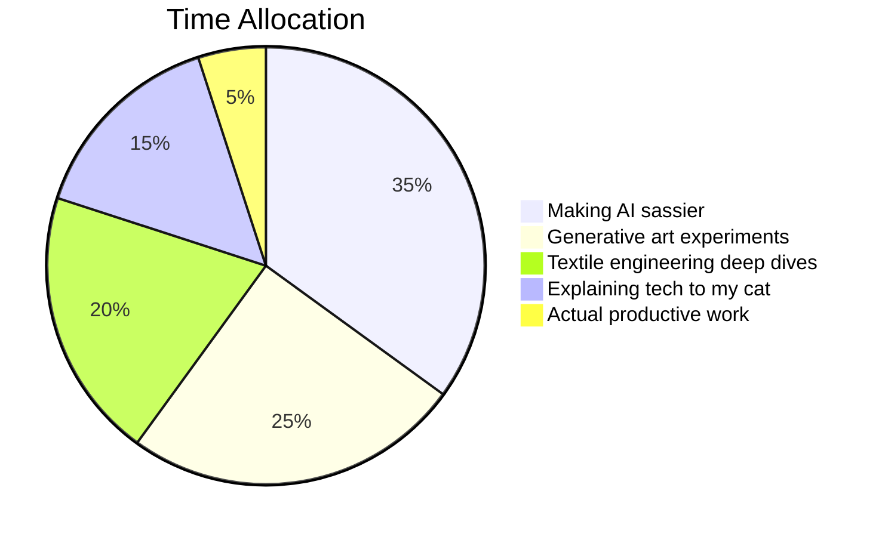

<p align="center">
  
  <br />
  <em>Scan me to explore my digital world!</em>
</p>

<h1 align="center">✨ 𝓡𝓮𝔂𝓻𝓸𝓿𝓮'𝓼 𝓓𝓲𝓰𝓲𝓽𝓪𝓵 𝓒𝓪𝓻𝓷𝓲𝓿𝓪𝓵 ✨</h1>

---

## 🌌 𝑾𝒆𝒍𝒄𝒐𝒎𝒆 𝒕𝒐 𝑴𝒚 𝑴𝒖𝒍𝒕𝒊𝒗𝒆𝒓𝒔𝒆

```javascript
// When AI meets textile engineering:
const reyrove = {
  disciplines: ["🧵 Textile Science", "🤖 Generative AI", "🎨 Computational Art"],
  superpower: "Turning coffee into surreal digital experiences",
  warning: "May contain traces of brilliance and excessive sass"
};
````

---

## 🎪 𝑴𝒂𝒊𝒏 𝑨𝒕𝒕𝒓𝒂𝒄𝒕𝒊𝒐𝒏𝒔

| **Project**               | **Description**                                      | **Live Demo**                         |
|---------------------------|------------------------------------------------------|----------------------------------------|
| 🦅 Sparrow Hawk CodeArt   | Neon-drenched AI art generator with sass             | [Create](https://sparrow-hawk-code-art-generator.vercel.app/) |
| 🖼️ Generative Art         | NFTs that don't look like bored apes                | [View](https://www.fxhash.xyz/u/reyrove)       |
| 🧶 Textile Tools           | For when you need to calculate yarn twist at 3AM     | [Calculate](https://reyrove.github.io/textile/textile.html) |
| 🎵 AI Music Generation    | Making algorithms sing (better than shower concerts) | [Listen](https://www.udio.com/creators/reyrove)     |

---

## 🌀 𝑻𝒆𝒄𝒉 𝑺𝒕𝒂𝒄𝒌 𝑹𝒂𝒊𝒏𝒃𝒐𝒘

<p align="center">
  
  
  
  
  
  
</p>

---

## 🤹‍♀️ 𝑪𝒖𝒓𝒓𝒆𝒏𝒕𝒍𝒚 𝑱𝒖𝒈𝒈𝒍𝒊𝒏𝒈



---

## 📡 𝑪𝒐𝒏𝒏𝒆𝒄𝒕 𝑾𝒊𝒕𝒉 𝑴𝒚 𝑫𝒊𝒈𝒊𝒕𝒂𝒍 𝑺𝒆𝒍𝒇

<p align="center"> 
  <a href="mailto:reyhanehdaneshdoost@gmail.com"></a> 
  <a href="https://x.com/reyrove"></a> 
  <a href="https://www.linkedin.com/in/reyhaneh-daneshdoost-730481160/"></a> 
  <a href="https://discord.com/users/reyrove"></a> 
</p>

<div align="center">

"Some people dream of success, I stay awake and code it" ✨

</div>